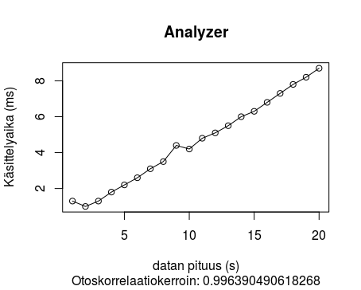
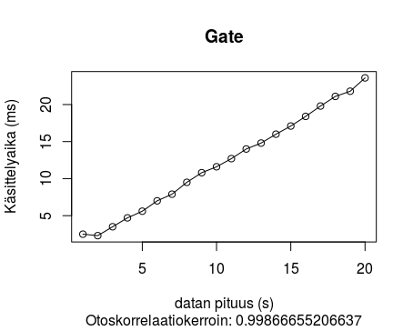
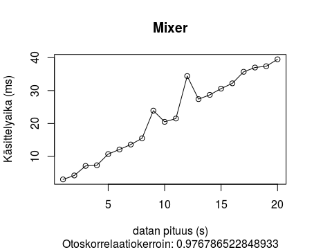
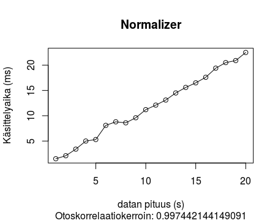
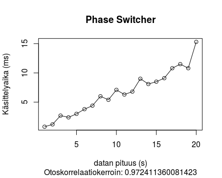
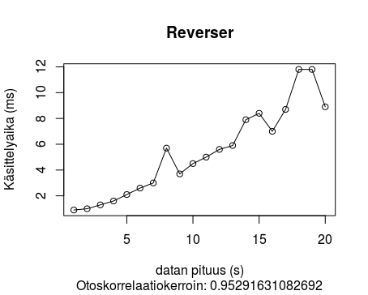

# Testausdokumentti

## Testien toteutus

Yksikkötestit ovat automatisoituja ja ne on toteutettu JUnitilla. Testit saadaan toistettua aina haluattaessa uudestaan ajamalla ne. Testien kattavuutta on seurattu Pit-testeillä. Testien kattavuus koodista on 95% ja mutaatioiden kattavuus 71%. Mutaatioiden testaamista ei ole tässä vaiheessa painotettu, sillä tärkeämpää on ollut saada ohjelmassa oikeasti käytössä olevat syötteet testattua.

## Testisyötteet

Jokaisen luokan kohdalla on testattu poikkeustilanteiden toimivuus, syötteiden raja-arvot sekä palautusarvojen oikeellisuus.

## Suorituskykytestit

Testit on toteutettu antamalla algoritmeille syötteenä CD-äänenlaatua vastaavia tasasekunttimääriä ääninäytteitä, ts. kuvaajissa datan pituus sekunneissa vastaa 44100 ääninäytettä / sekunti. Näin ollen esimerkiksi datan pituuden ollessa kuvaajassa 10 sekuntia, on algoritmi käsitellyt 441000 näytettä. Näin ollen kuvaajissa näkyvä pienin syöte on ollut 44100 näytettä ja suurin 882000 näytettä.

Testeissä jokaisen algoritmin kohdalla algoritmi on ajettu 1000 kertaa ja laskettu näistä keskiarvo.

Ajetut testit osoittavat, että Analyzer-algoritmi toimii O(n)-ajassa.

Ajetut testit osoittavat, että Gate-algoritmi toimii O(n)-ajassa.

Ajetut testit osoittavat, että Mixer-algoritmi toimii O(n)-ajassa.

Ajetut testit osoittavat, että Normalizer-algoritmi toimii O(n)-ajassa.

Ajetut testit osoittavat, että PhaseSwitcher-algoritmi toimii O(n)-ajassa.

Ajetut testit osoittavat, että Reverser-algoritmi toimii O(n)-ajassa.
